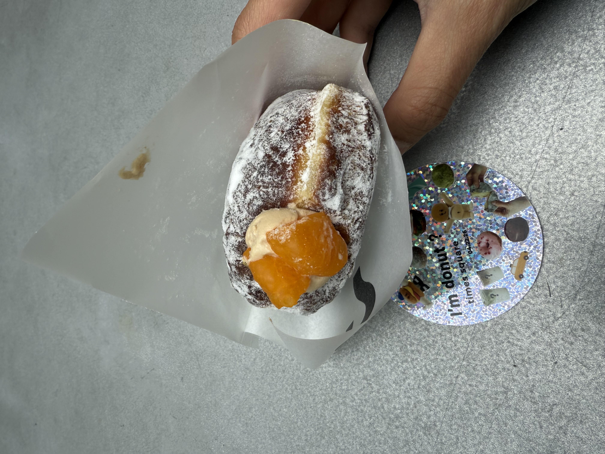

This chain from Japan is super popular and known for their nama donuts. The donuts are light, soft, and moist. The line used to be really bad when it first opened but now there is basically no wait. I'm a big fan of the tangerine milk tea donut. 
